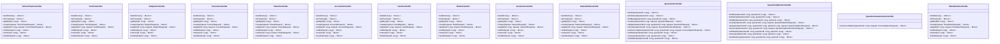

```mermaid


%% CONTROLLERS COM DTOs

classDiagram
    %% CONTROLLERS
    class SchoolYearController {
        +listAllActive() : Mono<ResponseEntity<List<SchoolYearResponse>>>
        +listTrashed() : Mono<ResponseEntity<List<SchoolYearResponse>>>
        +getById(id: Long) : Mono<ResponseEntity<SchoolYearResponse>>
        +create(request: SchoolYearRequest) : Mono<ResponseEntity<SchoolYearResponse>>
        +update(id: Long, request: SchoolYearRequest) : Mono<ResponseEntity<SchoolYearResponse>>
        +softDelete(id: Long) : Mono<ResponseEntity<Void>>
        +restore(id: Long) : Mono<ResponseEntity<Void>>
        +hardDelete(id: Long) : Mono<ResponseEntity<Void>>
    }

    class TermController {
        +listAllActive() : Mono<ResponseEntity<List<TermResponse>>>
        +listTrashed() : Mono<ResponseEntity<List<TermResponse>>>
        +getById(id: Long) : Mono<ResponseEntity<TermResponse>>
        +create(request: TermRequest) : Mono<ResponseEntity<TermResponse>>
        +update(id: Long, request: TermRequest) : Mono<ResponseEntity<TermResponse>>
        +softDelete(id: Long) : Mono<ResponseEntity<Void>>
        +restore(id: Long) : Mono<ResponseEntity<Void>>
        +hardDelete(id: Long) : Mono<ResponseEntity<Void>>
    }

    class SubjectController {
    +listAllActive() : Mono<ResponseEntity<List<SubjectResponse>>>
    +listTrashed() : Mono<ResponseEntity<List<SubjectResponse>>>
    +getById(id: Long) : Mono<ResponseEntity<SubjectResponse>>
    +create(request: SubjectRequest) : Mono<ResponseEntity<SubjectResponse>>
    +update(id: Long, request: SubjectRequest) : Mono<ResponseEntity<SubjectResponse>>
    +softDelete(id: Long) : Mono<ResponseEntity<Void>>
    +restore(id: Long) : Mono<ResponseEntity<Void>>
    +hardDelete(id: Long) : Mono<ResponseEntity<Void>>

    }

    class CourseController {
    +listAllActive() : Mono<ResponseEntity<List<CourseResponse>>>
    +listTrashed() : Mono<ResponseEntity<List<CourseResponse>>>
    +getById(id: Long) : Mono<ResponseEntity<CourseResponse>>
    +create(request: CourseRequest) : Mono<ResponseEntity<CourseResponse>>
    +update(id: Long, request: CourseRequest) : Mono<ResponseEntity<CourseResponse>>
    +softDelete(id: Long) : Mono<ResponseEntity<Void>>
    +restore(id: Long) : Mono<ResponseEntity<Void>>
    +hardDelete(id: Long) : Mono<ResponseEntity<Void>>

    }

    class ClassController {
    +listAllActive() : Mono<ResponseEntity<List<ClassResponse>>>
    +listTrashed() : Mono<ResponseEntity<List<ClassResponse>>>
    +getById(id: Long) : Mono<ResponseEntity<ClassResponse>>
    +create(request: ClassRequest) : Mono<ResponseEntity<ClassResponse>>
    +update(id: Long, request: ClassRequest) : Mono<ResponseEntity<ClassResponse>>
    +softDelete(id: Long) : Mono<ResponseEntity<Void>>
    +restore(id: Long, request: ClassRequest) : Mono<ResponseEntity<Void>>
    +hardDelete(id: Long) : Mono<ResponseEntity<Void>>

    }

    class AccountController {
    +listAllActive() : Mono<ResponseEntity<List<AccountResponse>>>
    +listTrashed() : Mono<ResponseEntity<List<AccountResponse>>>
    +getById(id: Long) : Mono<ResponseEntity<AccountResponse>>
    +create(request: AccountRequest) : Mono<ResponseEntity<AccountResponse>>
    +update(id: Long, request: AccountRequest) : Mono<ResponseEntity<AccountResponse>>
    +softDelete(id: Long) : Mono<ResponseEntity<Void>>
    +restore(id: Long) : Mono<ResponseEntity<Void>>
    +hardDelete(id: Long) : Mono<ResponseEntity<Void>>

    }

    class UserController {
    +listAllActive() : Mono<ResponseEntity<List<UserResponse>>>
    +listTrashed() : Mono<ResponseEntity<List<UserResponse>>>
    +getById(id: Long) : Mono<ResponseEntity<UserResponse>>
    +create(request: UserRequest) : Mono<ResponseEntity<UserResponse>>
    +update(id: Long, request: UserRequest) : Mono<ResponseEntity<UserResponse>>
    +softDelete(id: Long) : Mono<ResponseEntity<Void>>
    +restore(id: Long) : Mono<ResponseEntity<Void>>
    +hardDelete(id: Long) : Mono<ResponseEntity<Void>>

    }

    class RoleController {
    +listAllActive() : Mono<ResponseEntity<List<RoleResponse>>>
    +listTrashed() : Mono<ResponseEntity<List<RoleResponse>>>
    +getById(id: Long) : Mono<ResponseEntity<RoleResponse>>
    +create(request: RoleRequest) : Mono<ResponseEntity<RoleResponse>>
    +update(id: Long, request: RoleRequest) : Mono<ResponseEntity<RoleResponse>>
    +softDelete(id: Long) : Mono<ResponseEntity<Void>>
    +restore(id: Long) : Mono<ResponseEntity<Void>>
    +hardDelete(id: Long) : Mono<ResponseEntity<Void>>

    }

    class SessionController {
    +listAllActive() : Mono<ResponseEntity<List<SessionResponse>>>
    +listTrashed() : Mono<ResponseEntity<List<SessionResponse>>>
    +getById(id: Long) : Mono<ResponseEntity<SessionResponse>>
    +create(request: SessionRequest) : Mono<ResponseEntity<SessionResponse>>
    +update(id: Long, request: SessionRequest) : Mono<ResponseEntity<SessionResponse>>
    +softDelete(id: Long) : Mono<ResponseEntity<Void>>
    +restore(id: Long) : Mono<ResponseEntity<Void>>
    +hardDelete(id: Long) : Mono<ResponseEntity<Void>>

    }

    class StatementController {
    +listAllActive() : Mono<ResponseEntity<List<StatementResponse>>>
    +listTrashed() : Mono<ResponseEntity<List<StatementResponse>>>
    +getById(id: Long) : Mono<ResponseEntity<StatementResponse>>
    +create(request: StatementRequest) : Mono<ResponseEntity<StatementResponse>>
    +update(id: Long, request: StatementRequest) : Mono<ResponseEntity<StatementResponse>>
    +softDelete(id: Long) : Mono<ResponseEntity<Void>>
    +restore(id: Long) : Mono<ResponseEntity<Void>>
    +hardDelete(id: Long) : Mono<ResponseEntity<Void>>

    }

    class QuestionController {
    +listAll(statementId: Long) : Mono<ResponseEntity<List<QuestionResponse>>>
    +listDeleted(statementId: Long) : Mono<ResponseEntity<List<QuestionResponse>>>
    +findById(statementId: Long, questionId: Long) : Mono<ResponseEntity<QuestionResponse>>
    +create(statementId: Long, request: QuestionRequest) : Mono<ResponseEntity<QuestionResponse>>
    +update(statementId: Long, questionId: Long, request: QuestionRequest) : Mono<ResponseEntity<QuestionResponse>>
    +reorder(statementId: Long, request: QuestionReorderRequest) : Mono<ResponseEntity<List<QuestionResponse>>>
    +setCorrectOption(statementId: Long, questionId: Long, request: CorrectOptionRequest) : Mono<ResponseEntity<QuestionOptionResponse>>
    +softDelete(statementId: Long, questionId: Long) : Mono<ResponseEntity<Void>>
    +restore(statementId: Long, questionId: Long) : Mono<ResponseEntity<Void>>
    +hardDelete(statementId: Long, questionId: Long) : Mono<ResponseEntity<Void>>

    }

    class QuestionOptionController {
    +listAll(statementId: Long, questionId: Long) : Mono<ResponseEntity<List<QuestionOptionResponse>>>
    +listDeleted(statementId: Long, questionId: Long) : Mono<ResponseEntity<List<QuestionOptionResponse>>>
    +findById(statementId: Long, questionId: Long, optionId: Long) : Mono<ResponseEntity<QuestionOptionResponse>>
    +create(statementId: Long, questionId: Long, request: QuestionOptionRequest) : Mono<ResponseEntity<QuestionOptionResponse>>
    +update(statementId: Long, questionId: Long, optionId: Long, request: QuestionOptionRequest) : Mono<ResponseEntity<QuestionOptionResponse>>
    +reorder(statementId: Long, questionId: Long, request: QuestionOptionReorderRequest) : Mono<ResponseEntity<List<QuestionOptionResponse>>>
    +softDelete(statementId: Long, questionId: Long, optionId: Long) : Mono<ResponseEntity<Void>>
    +restore(statementId: Long, questionId: Long, optionId: Long) : Mono<ResponseEntity<Void>>
    +hardDelete(statementId: Long, questionId: Long, optionId: Long) : Mono<ResponseEntity<Void>>

    }

    class QuestionAnswerKeyController {
    +setCorrectOption(questionId: Long, request: CorrectOptionRequest) : Mono<ResponseEntity<QuestionOptionResponse>>

    }

    class SimulationController {
    +listAllActive() : Mono<ResponseEntity<List<SimulationResponse>>>
    +listTrashed() : Mono<ResponseEntity<List<SimulationResponse>>>
    +getById(id: Long) : Mono<ResponseEntity<SimulationResponse>>
    +create(request: SimulationRequest) : Mono<ResponseEntity<SimulationResponse>>
    +update(id: Long, request: SimulationRequest) : Mono<ResponseEntity<SimulationResponse>>
    +softDelete(id: Long) : Mono<ResponseEntity<Void>>
    +restore(id: Long) : Mono<ResponseEntity<Void>>
    +hardDelete(id: Long) : Mono<ResponseEntity<Void>>

    }


```
