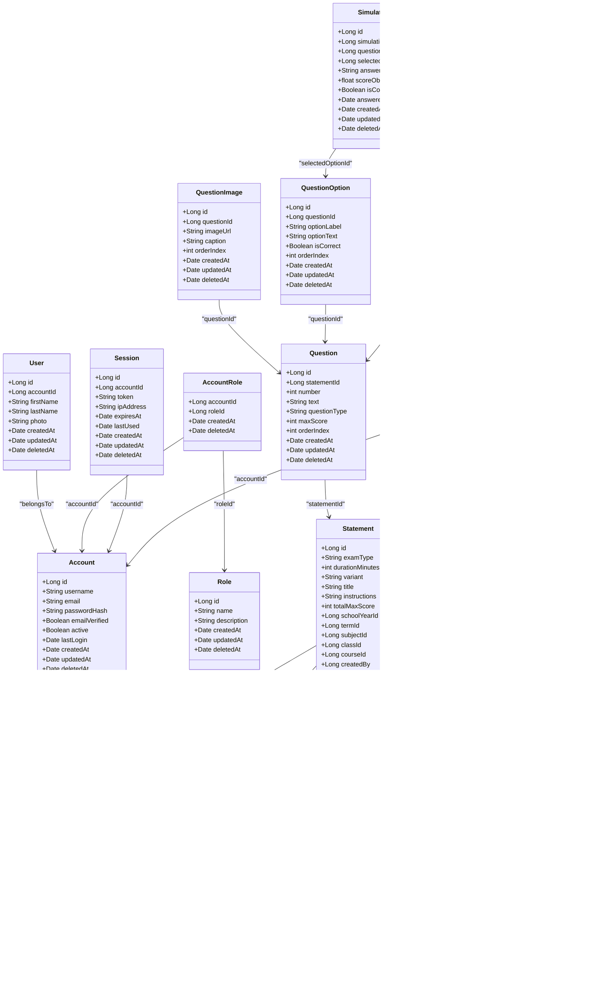

```mermaid

%% UML Class Diagram - Kixi Backend (Entities + Controllers com DTOs claros)

classDiagram
    %% ENTITIES
    class SchoolYear {
        +Long id
        +int startYear
        +int endYear
        +Date createdAt
        +Date updatedAt
        +Date deletedAt
    }

    class Term {
        +Long id
        +int number
        +String name
        +Date createdAt
        +Date updatedAt
        +Date deletedAt
    }

    class Subject {
        +String code
        +String name
        +String shortName
        +Date createdAt
        +Date updatedAt
        +Date deletedAt
    }

    class Course {
        +String code
        +String name
        +Date createdAt
        +Date updatedAt
        +Date deletedAt
    }

    class Class {
        +String code
        +String grade
        +Long courseId
        +Long schoolYearId
        +Date createdAt
        +Date updatedAt
        +Date deletedAt
    }

    class Account {
        +Long id
        +String username
        +String email
        +String passwordHash
        +Boolean emailVerified
        +Boolean active
        +Date lastLogin
        +Date createdAt
        +Date updatedAt
        +Date deletedAt
    }

    class User {
        +Long id
        +Long accountId
        +String firstName
        +String lastName
        +String photo
        +Date createdAt
        +Date updatedAt
        +Date deletedAt
    }

    class Role {
        +Long id
        +String name
        +String description
        +Date createdAt
        +Date updatedAt
        +Date deletedAt
    }

    class AccountRole {
        +Long accountId
        +Long roleId
        +Date createdAt
        +Date deletedAt
    }

    class Session {
        +Long id
        +Long accountId
        +String token
        +String ipAddress
        +Date expiresAt
        +Date lastUsed
        +Date createdAt
        +Date updatedAt
        +Date deletedAt
    }

    class Statement {
        +Long id
        +String examType
        +int durationMinutes
        +String variant
        +String title
        +String instructions
        +int totalMaxScore
        +Long schoolYearId
        +Long termId
        +Long subjectId
        +Long classId
        +Long courseId
        +Long createdBy
        +Boolean visible
        +Date createdAt
        +Date updatedAt
        +Date deletedAt
    }

    class Question {
        +Long id
        +Long statementId
        +int number
        +String text
        +String questionType
        +int maxScore
        +int orderIndex
        +Date createdAt
        +Date updatedAt
        +Date deletedAt
    }

    class QuestionImage {
        +Long id
        +Long questionId
        +String imageUrl
        +String caption
        +int orderIndex
        +Date createdAt
        +Date updatedAt
        +Date deletedAt
    }

    class QuestionOption {
        +Long id
        +Long questionId
        +String optionLabel
        +String optionText
        +Boolean isCorrect
        +int orderIndex
        +Date createdAt
        +Date updatedAt
        +Date deletedAt
    }

    class Simulation {
        +Long id
        +Long accountId
        +Long statementId
        +Long schoolYearId
        +Date startedAt
        +Date finishedAt
        +int timeSpentSeconds
        +float finalScore
        +String status
        +Date createdAt
        +Date updatedAt
        +Date deletedAt
    }

    class SimulationAnswer {
        +Long id
        +Long simulationId
        +Long questionId
        +Long selectedOptionId
        +String answerText
        +float scoreObtained
        +Boolean isCorrect
        +Date answeredAt
        +Date createdAt
        +Date updatedAt
        +Date deletedAt
    }

    %% RELATIONS
    Term --> SchoolYear : "belongsTo"
    Class --> Course : "belongsTo"
    Class --> SchoolYear : "belongsTo"
    User --> Account : "belongsTo"
    AccountRole --> Account : "accountId"
    AccountRole --> Role : "roleId"
    Session --> Account : "accountId"
    Statement --> SchoolYear : "schoolYearId"
    Statement --> Term : "termId"
    Statement --> Subject : "subjectId"
    Statement --> Class : "classId"
    Statement --> Course : "courseId"
    Question --> Statement : "statementId"
    QuestionImage --> Question : "questionId"
    QuestionOption --> Question : "questionId"
    Simulation --> Account : "accountId"
    Simulation --> Statement : "statementId"
    Simulation --> SchoolYear : "schoolYearId"
    SimulationAnswer --> Simulation : "simulationId"
    SimulationAnswer --> Question : "questionId"
    SimulationAnswer --> QuestionOption : "selectedOptionId"
```
